# Data visualization analysis of new energy vehicle-related microblogs

# Directory

1. [Introduction](#introduction)

2. [Programming](#programming)

   2.1. [Data Preprocessing](#Data-Preprocessing)

   2.2. [Fundamental Analysis](#fundamental-analysis)

      2.2.1. [The Number of Microblogs Varies Over Time](#the-number-of-microblogs-varies-over-time)

      2.2.2. [Gender Distribution Changes Over Time](#gender-distribution-changes-over-time)

      2.2.3. [Geographical Distribution](#geographical-distribution)

      2.2.4. [Weibo Sentiment Changes Over Time](#weibo-sentiment-changes-over-time)

      2.2.5. [Popular Weibo](#popular-weibo)

   2.3. [Text Analytics](#text-analytics)

      2.3.1. [Sentiment Analysis](#sentiment-analysis)

      2.3.2. [Participle](#participle)

      2.3.3. [Extract Keywords](#extract-keywords)

      2.3.4. [LDA Topic Model](#lda-topic-model)

      2.3.5. [Word Cloud Diagrams](#word-cloud-diagrams)

3. [Results And Analysis Are Discussed](#results-and-analysis-are-discussed)

   3.1. [Fundamental Analysis](#fundamental-analysis-1)

      3.1.1. [Changes in The Number of Microblogs Over Time](#the-number-of-microblogs-varies-over-time-1)

      3.1.2. [Gender Distribution Changes Over Time](#gender-distribution-changes-over-time-1)

      3.1.3. [Geographical Distribution](#geographical-distribution-1)

      3.1.4. [Popular Weibo](#popular-weibo-1)

      3.1.5. [Weibo Sentiment Changes Over Time](#weibo-sentiment-changes-over-time-1)

   3.2. [Text Analytics](#text-analytics-1)

      3.2.1. [Keyword](#keyword)

      3.2.2. [LDA Topic Model](#lda-topic-model-1)

      3.2.3. [Word Clouds](#word-clouds)

4. [Conclusions and Recommendations](#conclusions-and-recommendations)

# Introduction

Under the urgent need to alleviate global warming and energy crisis, the
global automobile industry is in a new stage of transformation and
upgrading, and the development of new energy vehicles is an important
part of it. In the context of the era of consumer sovereignty, many
companies have gradually realized that if they want to stabilize the
market and maintain their competitive advantage, they must do a good job
in consumer strategy, so consumers are very important participants in
the new energy vehicle market. The grasp and prediction of consumer
purchase behavior is conducive to the formulation of policies and
marketing strategies for the promotion of new energy vehicles, so as to
provide guidance for the development of new energy vehicles. As of 2022,
China's new energy vehicles have ranked first in the world in terms of
production and sales for seven consecutive years, with a cumulative
promotion of more than 10 million units, and the cumulative penetration
rate has also shown a steady upward trend, making it the world's largest
new energy vehicle market. China's new energy vehicle industry has
certain advantages in terms of market size, technology and international
competitiveness, and at the same time, due to the influence of cultural
differences on Chinese consumers, it has unique characteristics, so it
is necessary to study the characteristics of Chinese new energy vehicle
consumers.

This paper analyzes the original Weibo samples released by nearly 600
Weibo users in the two years from February 1, 2019 to January 31, 2021,
including basic analysis and text analysis, the basic analysis includes
the analysis of the number of Weibo over time, the analysis of gender
distribution over time, the analysis of geographical distribution, the
analysis of Weibo sentiment over time, and the examples of popular
Weibo, and the text analysis includes sentiment analysis, keyword
extraction, LDA topic analysis, and word cloud analysis. The purpose of
this paper is to extract the characteristics of Chinese NEV consumers
and provide suggestions for the further promotion of NEVs.

#  Programming

## Data Preprocessing

Filter the data from the original Weibo sample .csv, and the filter
conditions are: Weibo content includes "new energy" and "car", and then
use drop\_duplicates () to deduplicate the filtered content, and export
the data as related to new energy vehiclesWeibo data .csv. The code is
shown in Figure 1.

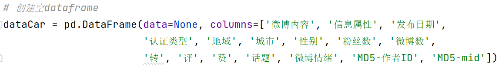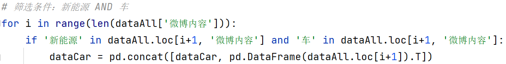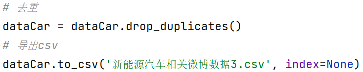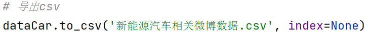

1.  **Data preprocessing code**

The data extraction results are shown in Figure 2. The number of
original data entries is 664,090, the number of data entries filtered by
conditions is 2,030, and the number of data entries after deduplication
and cleaning is 2,011, city, gender, number of fans, number of Weibo,
transfer, comment, like,Topic, Weibo sentiment, MD5-author ID, MD5-mid.

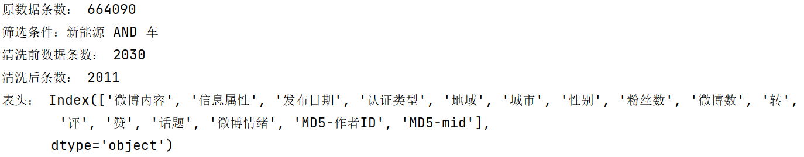

1.  **Data preprocessing results**

## Fundamental Analysis

The basic analysis includes the analysis of the change of the number of
microblogs over time, geographical distribution, examples of popular
microblogs, and analysis of the change of microblog sentiment over time,
and the main program is main.py.

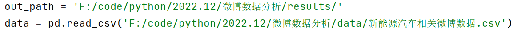

1.  The result output path and data import in the main.py

### The number of microblogs varies over time

main.py call the number.py method number() to pass in the data and
out\_path of the "Release Date" column.

In the number.py, the time format is first converted from YYYY/MM/DD
HH:MM to the format of YYYY/MM by calling the getdate() method in the
getdate.py, and the specific conversion process is as follows:
split('/') to split, extract items 0 and 1, and then use '/'Perform
splicing. Then call the count() method in the count.py to count the
number of occurrences of each date and save it as a dictionary format
time\_dic. Finally, the time\_dic is imported into the draw.py
draw\_line() method to draw the line chart, and the specific drawing
process is as follows: first, solve the problem of garbled Chinese, and
then use dic.keys() as the horizontal axis and dic.values() as the
vertical axis to plot with plt.plot(). The above code is shown in Figure
4.

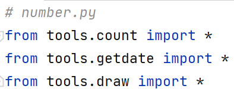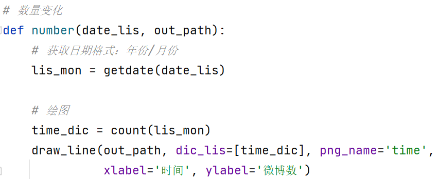

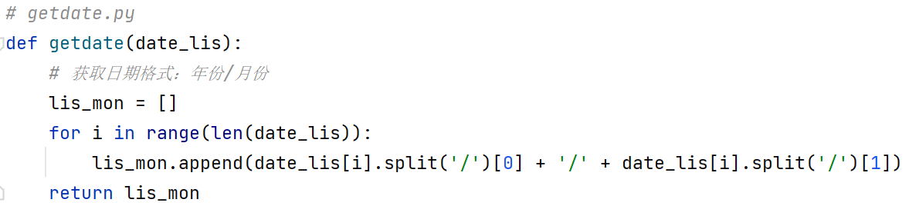

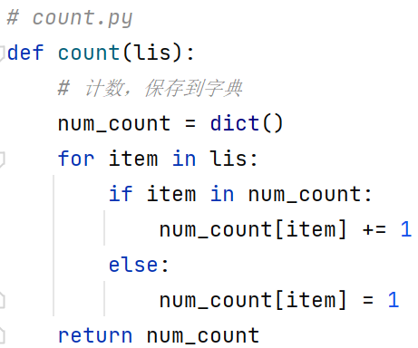

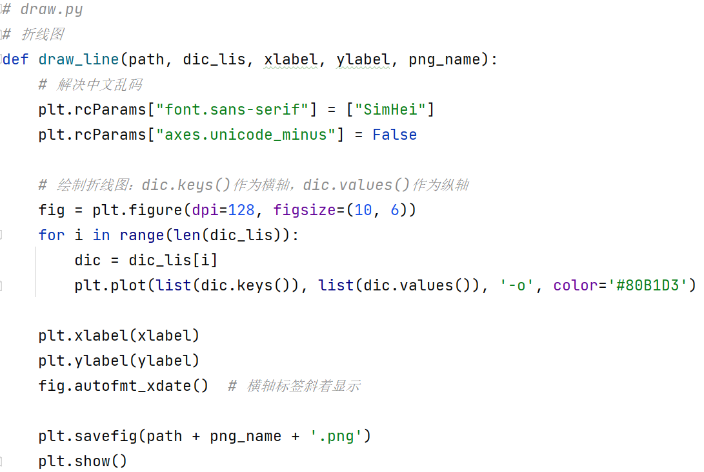

1.  **The number of microblogs changes over time**

### Gender distribution changes over time

main.py call the sex.py method sex() to pass in the data and out\_path
of the "Release Date" and "Gender" columns.

In the sex .py, the time is first converted to the format of YYYY/MM,
and then the dataframe is divided into man\_df with "gender" as "male"
and "gender" as "female". "The woman\_ df. Then use count() to count the
number of occurrences of each date, and save it as man\_dic and
woman\_dic. Finally, the man\_dic and woman\_dic are imported as a
dictionary list into the draw\_stacked() method in the draw.py to draw
the stacked area chart. The above code is shown in Figure 5.

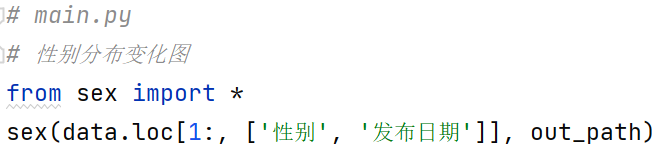

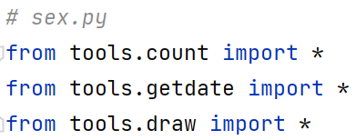

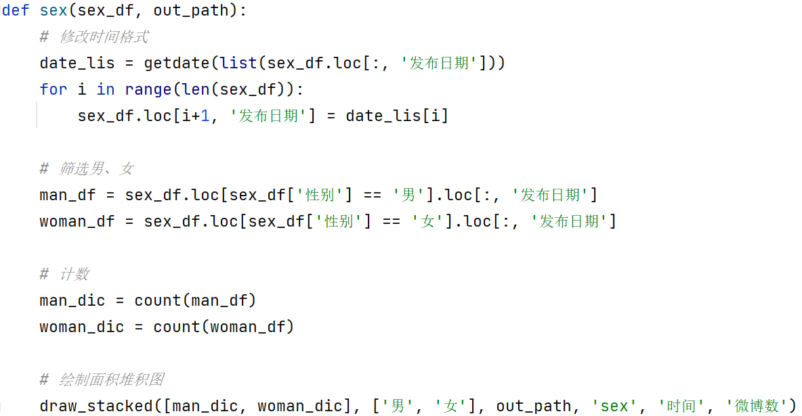

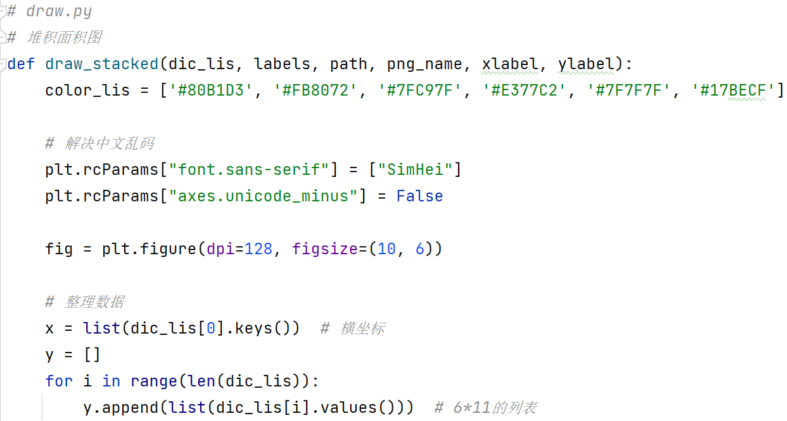

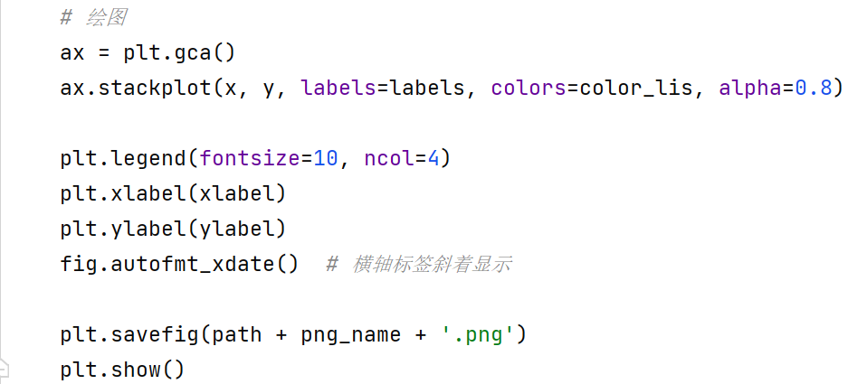

1.  **Gender distribution over time code**

### Geographical distribution

main.py call the area.py method area() to pass in the data and out\_path
of the "Region" column.

In the area .py, count count() to count the number of occurrences in
each region and save it as an area \_dic. Then import the area \_dic
into the draw\_map() method in the draw.py to draw the stacked area
chart. The area chart is drawn using the Map method in the pyecharts
package to generate an interactive map in html format. Since the
required province is named with the full name, and the province in the
original data is named with the abbreviation, the abbreviation must be
converted to the full name first. Then convert the dictionary into a
list of tuples, use the map = Map() statement to prepare the map object,
then use the set\_global\_opts() method to decorate, set the title
"Geographical distribution of microblog numbers", is\_show=True to
display the province name, is\_piecewise=True to display the segment,
pieces to put the segmentation information, and finally use
map.add().Add data and set the map to "China", map.render() generates an
interactive html geographic map. The above code is shown in Figure 6.

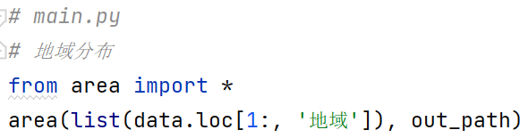

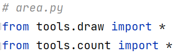

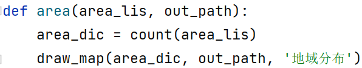

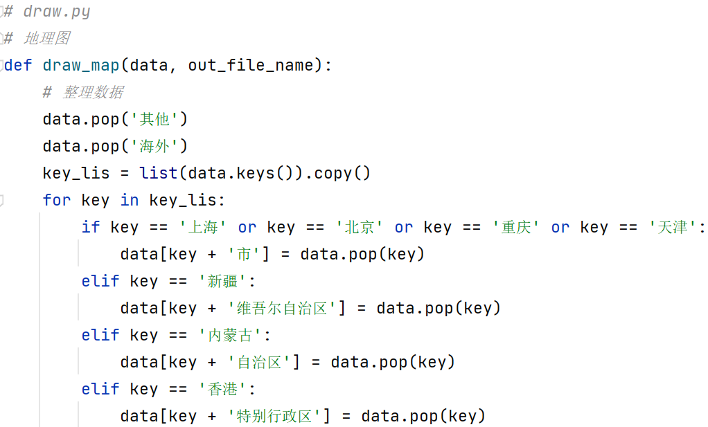

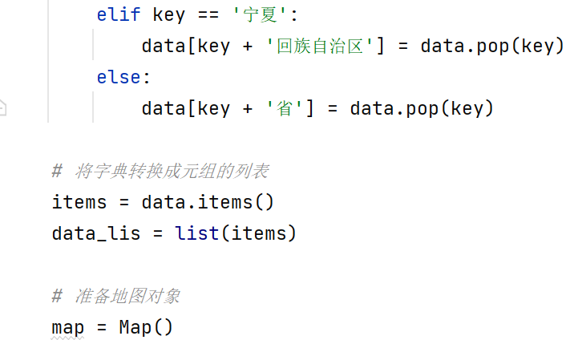

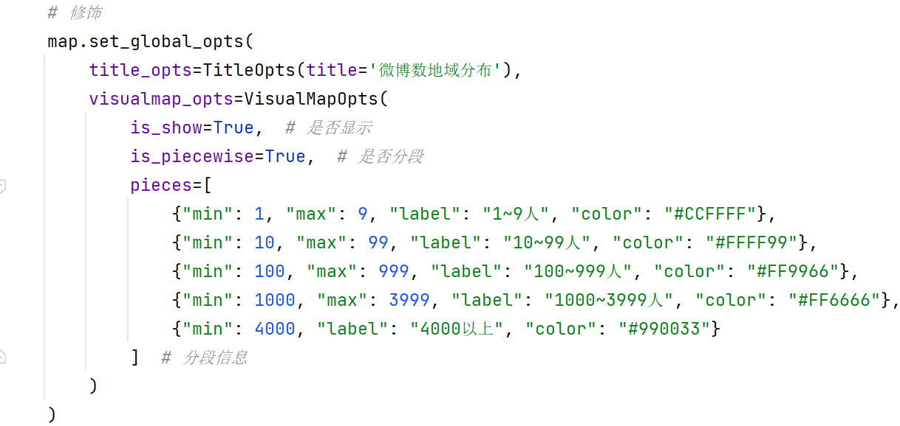

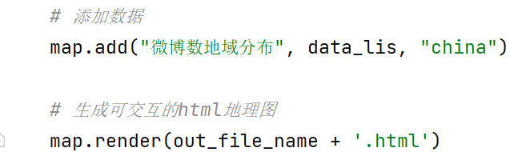

1.  **Geographic distribution code**

### Weibo sentiment changes over time

main.py call emotion.py method emotion() to pass in the data and
out\_path of the "Weibo Sentiment" and "Post" columns.

In emotion.py, first convert the time to YYYY/MM format, and then divide
the dataframe into six dataframes with "Weibo emotions" of "joy",
"fear", "neutral", "anger", "sadness", and "surprise", and then use
count().The number of occurrences of each date is counted for each
dataframe and saved as six dictionaries. Finally, the six dictionaries
are imported as a dictionary list into the draw\_stacked() method in the
draw.py to plot the stacked area chart. The above code is shown in
Figure 7.

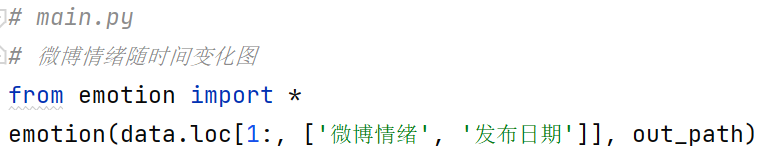

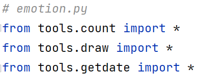

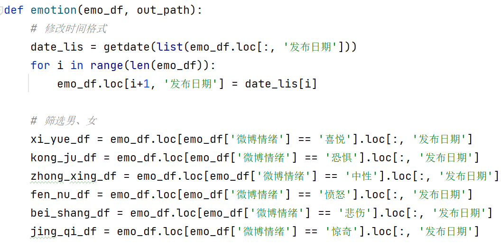

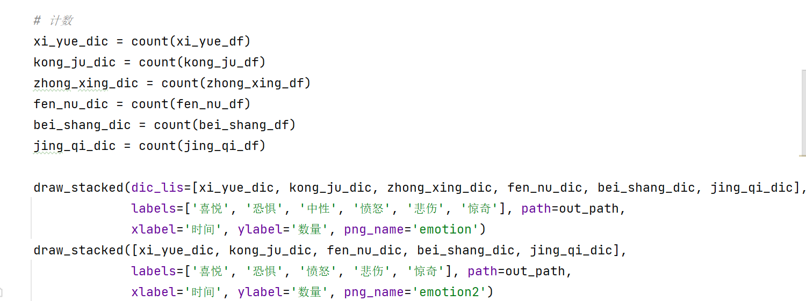

1.  **Weibo sentiment over time code**

### Popular Weibo

main.py call hot.py method number() to pass in data and out\_path.

In hot.py, first create the sum columns of "Turn", "Comment", "Like",
then sort them in descending order according to the column sum, and
finally export the first 5 rows of data. The above code is shown in
Figure 8.

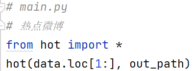

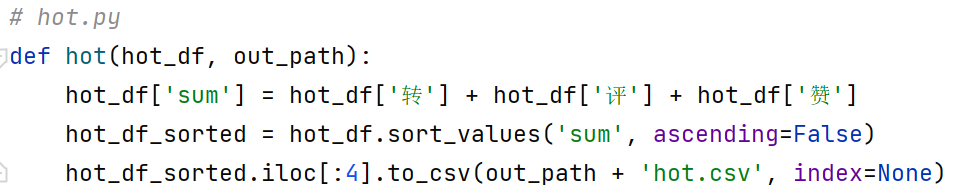

1.  **Popular microblogging code**

## Text Analytics

Text analysis includes sentiment analysis, word segmentation, keyword
extraction, LDA topic model, word cloud, and the main program is
text\_analysis .py. Figure 9 shows the code for text analysis data
preparation, extracting Weibo content and saving it to Weibo
contentcsv。

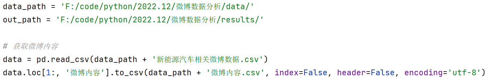

1.  **Text Analytics data preparation code**

### Sentiment analysis

text\_analysis.py call the sentiment.py method get\_sentiment () to save
the output positive data to the positive .csv and the negative data to
the negative .csv.

In sentiment.py, use the snownlp package for sentiment analysis. snownlp
is a Chinese sentiment analysis package written in Python, which comes
with a training set of positive and negative Chinese sentiments, mainly
a corpus of comments. SnowNLP uses the Naive Bayesian principle to train
and predict data. A sentiment value greater than or equal to 0.6 is
considered positive, and a sentiment value of 0.4 or less is considered
negative. Then, the Weibo content and sentiment value are combined into
the dataframe format, and the first row of empty values is deleted and
exported. The above code is shown in Figure 10.

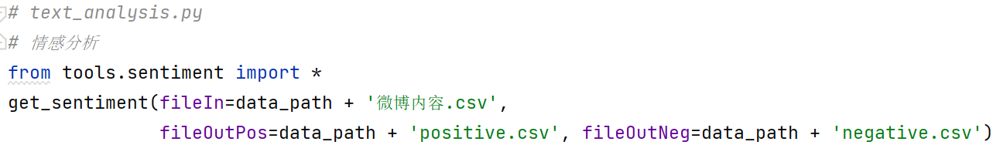

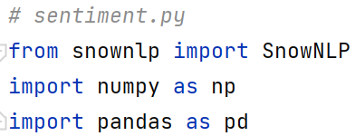

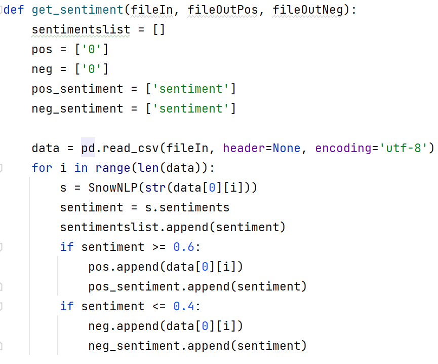

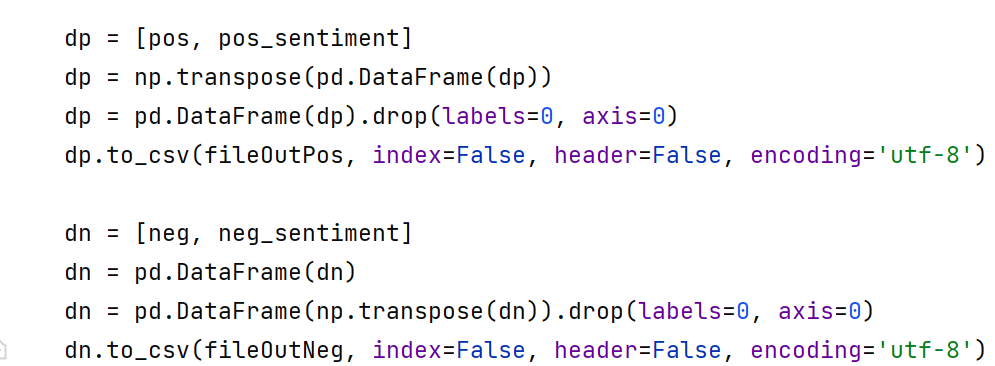

1.  **Sentiment analysis code**

### participle

text\_analysis.py call the fenci.py method fenci() to save the output
tokenization data to the tokenization .csv, positive\_segmentation.csv
and negative\_Word segmentation .csv.

In fenci .py, use jieba packets for word segmentation. First, use
jieba.cut() for word segmentation, and then load the local stop word
thesaurus stopwords.txt. After the initial attempt, the data exported by
the LDA model includes interference information such as "##", "http",
"month", "day", etc., so it takes several modifications to stopwords.txt
to eliminate interference and obtain ideal results. The above code is
shown in Figure 11.

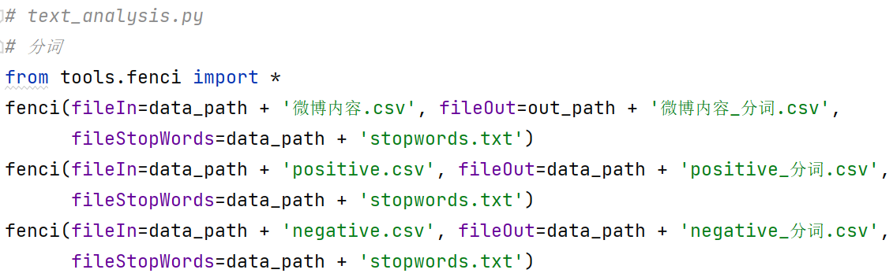

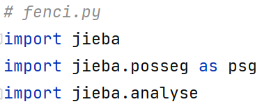

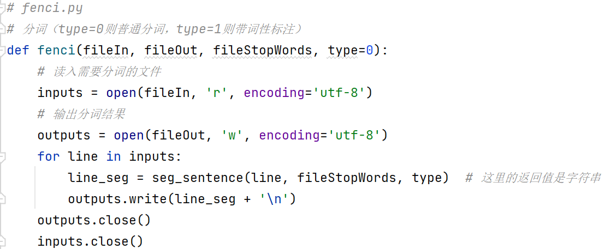

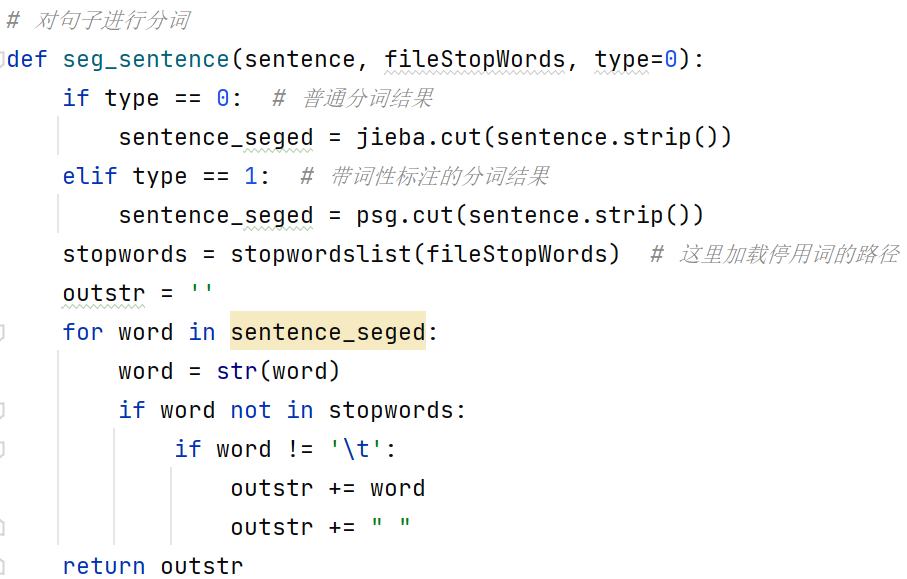

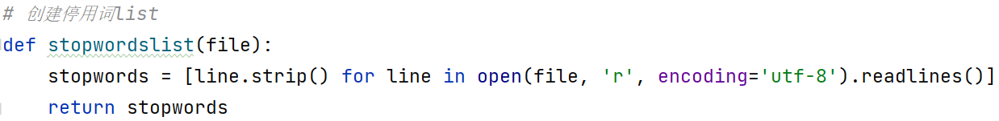

1.  **Tokenization codes**

### Extract keywords

text\_analysis.py call the fenci.py method get\_tags () to import the
segmentation data, and save the output keyword data to the keyword .txt
and positive\_ keywords. txt and negative\_ keywords .txt.

In fenci .py, use jieba packets for word segmentation. Use
jieba.analyse.extract\_tags () to extract keywords, extract the top 20
keywords, the top 10 noun keywords, the top 10 verb keywords, and the
top 10 adjective keywords. The above code is shown in Figure 12.

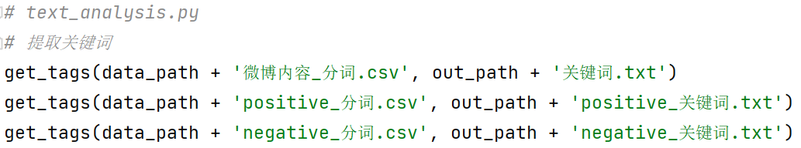

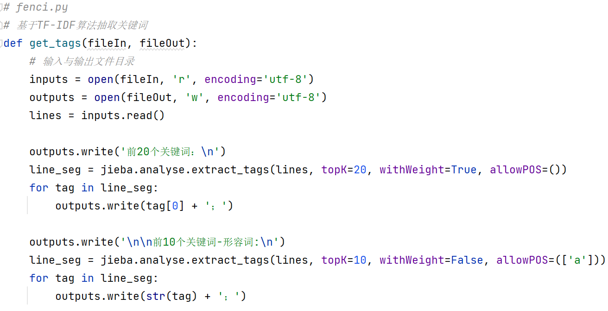

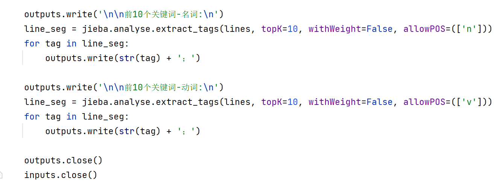

1.  **Extract keyword codes**

### LDA Topic Model

text\_analysis.py call LDA's .py method LDA() to import the segmented
data and save the output keyword data to LDA.txt and positive\_LDA.txt
and negative\_ LDA .txt.

In LDA .py, tokenization is done with gensim packets. Topic models, in
areas such as machine learning and natural language processing, are
statistical models used to discover abstract topics in a series of
documents. LDA is a document generation model in which an article has
multiple topics, each corresponding to a different word. The above code
is shown in Figure 13.

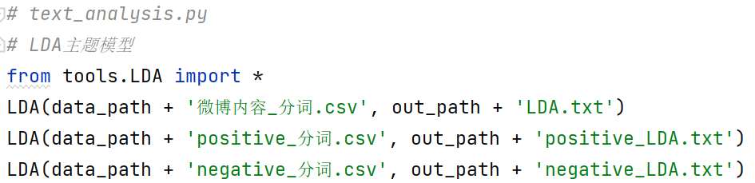

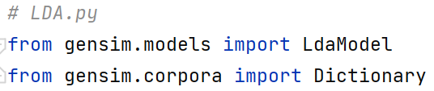

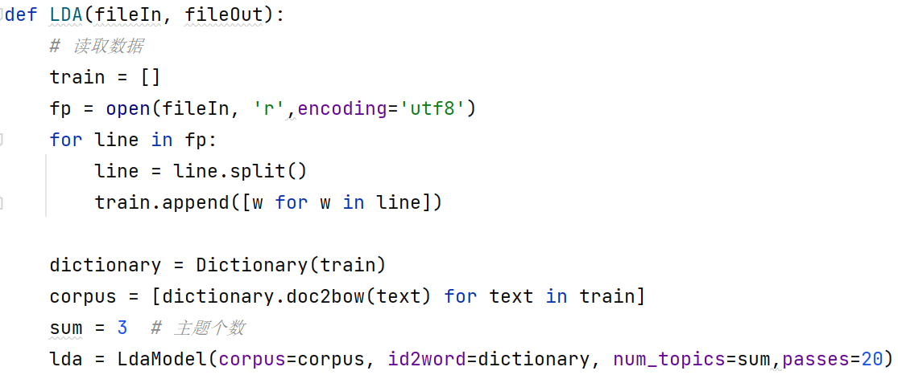

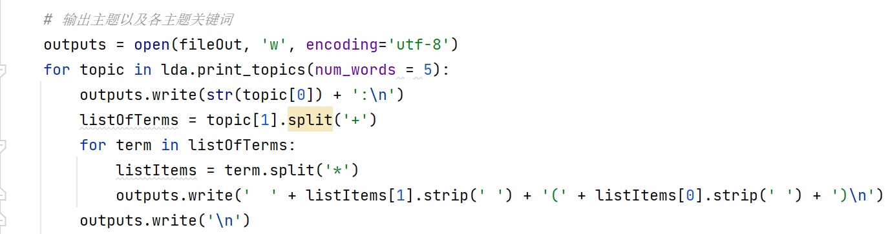

1.  **LDA topic model code**

### Word cloud diagrams

text\_analysis.py call the word\_cloud.py method word\_cloud () to
import the segmented data and output three word clouds.

In the word\_cloud .py, draw a word cloud with the wordcloud package.
Set the font size, font, background color, and color set of the word
cloud, use generate() to generate the word cloud, and save and display
it. The above code is shown in Figure 14.

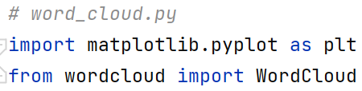

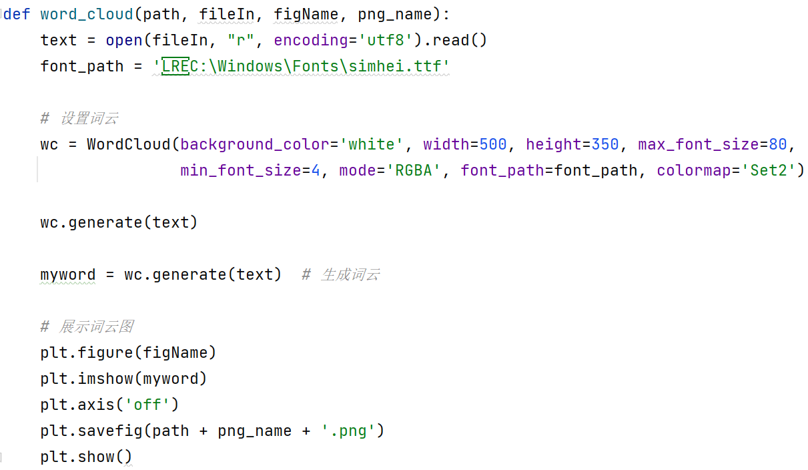

1.  **Word cloud code**

#  Results and analysis are discussed

## Fundamental Analysis

### The number of microblogs varies over time

Figure 15 is a line chart of the number of microblogs over time. It can
be seen that the number of microblogs related to new energy vehicles
reached a trough in September 2020, reached a second peak in January
2020 and March 2020, and the peak appeared in January 2021, the latest
time. In April 2020, BYD's "blade" battery news attracted widespread
attention, and at the end of 2020, the General Office of the State
Council issued the "New Energy Vehicle Industry Development Plan
(2021-2035)" as a programmatic policy for the new energy vehicle
industry, which attracted enthusiastic attention. The line chart shows
an increasing trend as a whole, and it is predicted that the number of
Weibo related to new energy vehicles will continue to increase in the
future, and people's attention to new energy vehicles will continue to
rise.

1.  **Line graph of the number of microblogs over time**

### Gender distribution changes over time

Figure 16 is a stacked area plot of the number of microblogs by gender
over time. The male-to-female ratio of NEVs-related microblogs is about
3:1, so men pay more attention to NEVs than women. Not only that, this
proportion is gradually increasing, and the promotion of new energy
vehicles should strengthen the publicity of female consumers.

1.  **Stacked area plot of the number of microblogs by gender over
    time**

### Geographical distribution

Figure 17 is a geographical map of geographical distribution. Zhejiang
Province has paid the most attention to new energy vehicles, with more
than 4,000 microblogs, followed by Guizhou Province and Jiangsu
Province, with more than 1,000 microblogs. This result is inconsistent
with common sense, and it is generally believed that the highest
attention to new energy vehicles should be in first-tier cities, but the
results of this experiment show that second- and third-tier cities have
a high degree of attention, which may be related to the sample. This
also means that new energy vehicles need to be further promoted.

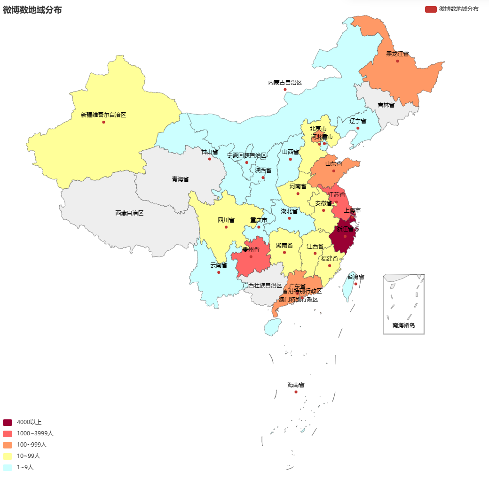

1.  **Geographical map of geographical distribution**

### Popular Weibo

Figure 18 is an example of a popular Weibo. The screenshot shows the top
5 Weibo information with the total number of retweets, comments, and
likes. The No. 1 Weibo is about the blade battery released by BYD at the
end of March 2020, which uses lithium iron phosphate technology, which
is a major improvement in the battery technology of new energy vehicles,
and the No. 2 Weibo is about the selection of Kaiwo Automobile in Lishui
District, Nanjing City into the "2019 Hurun Global Unicorn List". At the
same time, the third Weibo is about the end of 2020 China has become the
world's largest car ownership country, representing China's new energy
vehicle industry to the world, and the fourth Weibo is about the
development of the field of new energy heavy trucks, which is the second
time that Lishui has appeared on the hot list, and about the "unpopular"
of heavy trucks In June 2019, Nanjing Lishui has a prominent development
in the field of new energy vehicles, and Weibo, which ranked fourth,
accused China Automotive Group of investing too little in R&D, which is
comparable to the investment in publicity, indicating that China
Automotive still needs to invest more in R&D.

To sum up, the news about technology and R&D will be more concerned by
Weibo users, indicating that new energy vehicles are still in the stage
of technological development, and China's new energy vehicle industry
still has a lot of room for development in terms of technology.

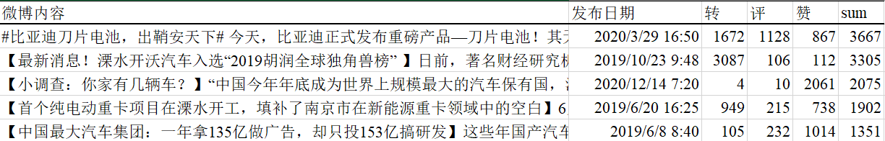

1.  **Examples of popular Weibo**

### Weibo sentiment changes over time

Figure 19 is a stacked area plot of different microblog sentiments over
time. As can be seen from the graph on the left, neutral emotions
account for the largest proportion. The figure on the right shows that
the proportion of emotions of anger, fear, and joy is equal, the
proportion of sadness is less, and the proportion of surprise is almost
none. Anger and fear are related to car accidents, strong negative
emotions will also attract more attention, joy is related to industrial
development, and new energy vehicle related topics are difficult to
relate to sadness.

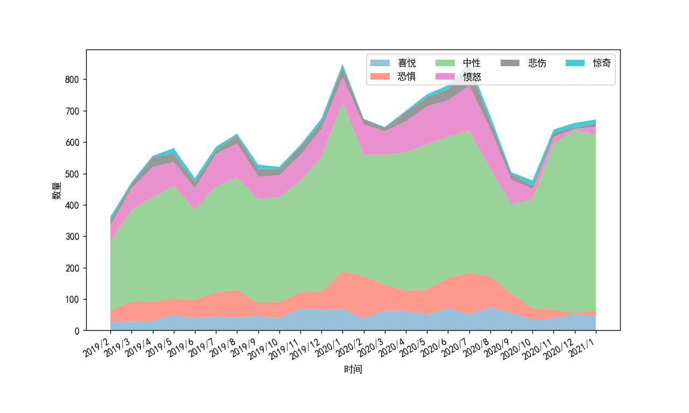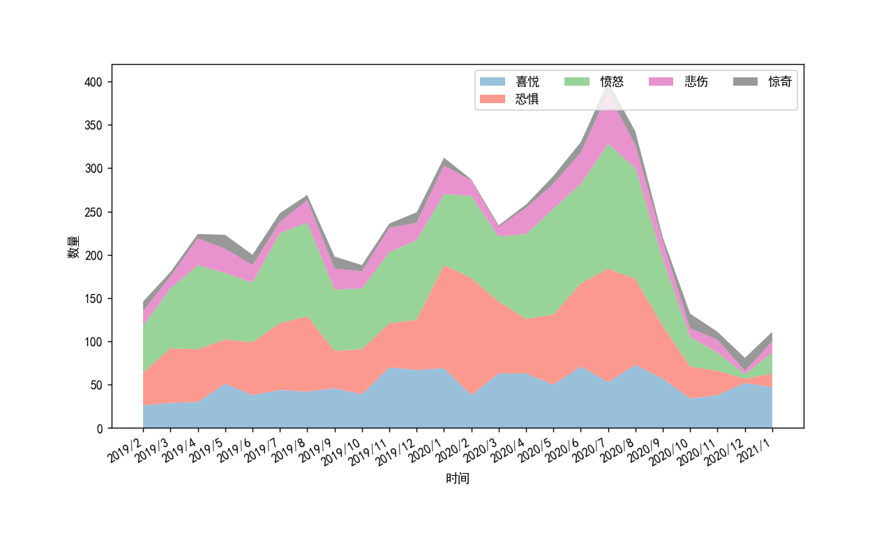

1.  **Stacked area plot of different microblog sentiments over time**

## Text Analytics

### keyword

Tables 1, 2, and 3 are the keyword list, positive sentiment keyword
list, and negative sentiment keyword list, respectively.

As can be seen from Table 1, "Tesla" indicates that people are paying
great attention to the car company Tesla, which is the leader of the new
energy vehicle industry; "technology", "development" and "growth"
indicate that the new energy vehicle industry is still in the stage of
technological development, and people's trust in technology may not be
high enough; "epidemic" indicates that the epidemic may have a certain
impact on the new energy vehicle market, and "charging" and "cleaning"
It shows that people pay more attention to charging technology and clean
energy, charging technology is the key technology in new energy vehicle
technology, and clean energy is the difficulty of the development of the
automobile industry. As can be seen from Table 2, there is a lot of
confidence in the new energy-related stock sector, and the stock price
is expected to rise. As can be seen from Table 3, the subsidy reduction
policy may have a resistance to the development of new energy vehicles.

1.  **Keyword list**

<table>
<colgroup>
<col style="width: 100%" />
</colgroup>
<thead>
<tr class="header">
<th>Top 20 Keywords:</th>
</tr>
</thead>
<tbody>
<tr class="odd">
<td>New Energy, Automotive, 2019, 2020, Tesla, Corporate, A-share, 10,
Market, China, Corporate, Technology, Development, 100 million yuan,
Industry, 11, 12, Epidemic, Charging, Growth</td>
</tr>
<tr class="even">
<td>Top 10 Keywords - Adjectives:</td>
</tr>
<tr class="odd">
<td>Infrastructure, Clean, Advanced, Supporting, Continuous, Healthy,
Stable, Successful, Large, Implemented</td>
</tr>
<tr class="even">
<td>Top 10 Keywords-Nouns:</td>
</tr>
<tr class="odd">
<td>New Energy, Automobile, Enterprise, A-share, Market, Company,
Technology, Industry, Epidemic, Sector</td>
</tr>
<tr class="even">
<td>Top 10 Keywords - Verbs:</td>
</tr>
<tr class="odd">
<td>Charging, Growth, Innovation, Manufacturing, Rising, Ascension,
Release, Promise, Push, Attention</td>
</tr>
</tbody>
</table>

1.  **List of positive sentiment keywords**

<table>
<colgroup>
<col style="width: 100%" />
</colgroup>
<thead>
<tr class="header">
<th>Top 20 Keywords:</th>
</tr>
</thead>
<tbody>
<tr class="odd">
<td>New Energy, Automobile, 2019, 2020, A-shares, Enterprise, Market,
Technology, China, Development, Tesla, Industry, Company, 100 million,
Epidemic, 5G, 10, Investment, Industry, Sector</td>
</tr>
<tr class="even">
<td>Top 10 Keywords - Adjectives:</td>
</tr>
<tr class="odd">
<td>Infrastructure, advanced, clean, supportive, continuous, healthy,
stable, successful, large, implemented</td>
</tr>
<tr class="even">
<td>Top 10 Keywords-Nouns:</td>
</tr>
<tr class="odd">
<td>New Energy, Automobile, A-share, Enterprise, Market, Technology,
Industry, Company, Epidemic, Industry</td>
</tr>
<tr class="even">
<td>Top 10 Keywords - Verbs:</td>
</tr>
<tr class="odd">
<td>Growth, Innovation, Charging, Manufacturing, Promotion, Concern,
Prospect, Rise, Push, Advance</td>
</tr>
</tbody>
</table>

1.  **List of negative sentiment keywords**

<table>
<colgroup>
<col style="width: 100%" />
</colgroup>
<thead>
<tr class="header">
<th>Top 20 Keywords:</th>
</tr>
</thead>
<tbody>
<tr class="odd">
<td>New Energy, Automobiles, Tesla, 10, 2020, Charging, 11, 2019, 1027,
12, Subsidy, Company, 10,000 units, YoY, 20, 30, Vehicles, 100 million
yuan, Ministry of Industry and Information Technology, Sales volume</td>
</tr>
<tr class="even">
<td>Top 10 Keywords - Adjectives:</td>
</tr>
<tr class="odd">
<td>Clean, continuous, supporting, infrastructure, contract, stability,
average, health, safety, implementation</td>
</tr>
<tr class="even">
<td>Top 10 Keywords-Nouns:</td>
</tr>
<tr class="odd">
<td>New Energy, Automobiles, Subsidies, Companies, Vehicles, Sales,
Energy, Enterprises, Electric Vehicles, Limited Companies</td>
</tr>
<tr class="even">
<td>Top 10 Keywords - Verbs:</td>
</tr>
<tr class="odd">
<td>Charging, Release, Growth, Limit, Decline, Decline, Rise, Production
and Sales, Related, Exceeding</td>
</tr>
</tbody>
</table>

### LDA Topic Model

Tables 4, 5, and 6 are the LDA topic model table, the LDA topic model
table for positive emotions, and the LDA topic model table for negative
emotions, respectively.

As can be seen from Table 4, the domestic new energy vehicle brand
"Leap", the new energy stock sector, and the investment of China's new
energy vehicle companies are the three major themes of related Weibo. As
can be seen from Table 5, people are bullish on new energy stocks and
maintain a positive attitude. As can be seen from Table 6, people are
negative about Tesla, a new energy vehicle company, and at the same
time, the development of charging technology may not be smooth.

1.  **LDA Topic Model Results**

<table>
<colgroup>
<col style="width: 33%" />
<col style="width: 33%" />
<col style="width: 33%" />
</colgroup>
<thead>
<tr class="header">
<th>0:</th>
<th>1:</th>
<th>2:</th>
</tr>
</thead>
<tbody>
<tr class="odd">
<td>
"Central Bank" (0.014)

"Auto" (0.013)

"100 million yuan" (0.011)

"New Energy" (0.009)

"Zero" (0.008)
</td>
<td>
"Auto" (0.008)

Market (0.008)

"New Energy" (0.008)

Point (0.006)

"Plate" (0.006)
</td>
<td>
"New Energy" (0.014)

"Auto" (0.014)

"China" (0.007)

"Enterprise" (0.006)

"Investment" (0.006)
</td>
</tr>
</tbody>
</table>

1.  **Positive Sentiment LDA Topic Model Results**

<table>
<colgroup>
<col style="width: 33%" />
<col style="width: 33%" />
<col style="width: 33%" />
</colgroup>
<thead>
<tr class="header">
<th>0:</th>
<th>1:</th>
<th>2:</th>
</tr>
</thead>
<tbody>
<tr class="odd">
<td>
Market (0.012)

"Plate" (0.008)

"New Energy" (0.006)

"Industry" (0.006)

"A Shares" (0.006)
</td>
<td>
"Auto" (0.010)

"Development" (0.009)

"Enterprise" (0.009)

"China" (0.008)

"New Energy" (0.008)
</td>
<td>
"Auto" (0.010)

"New Energy" (0.008)

"Company" (0.008)

"China" (0.008)

Point (0.007)
</td>
</tr>
</tbody>
</table>

1.  **Negative Sentiment LDA Topic Model Results**

<table>
<colgroup>
<col style="width: 33%" />
<col style="width: 33%" />
<col style="width: 33%" />
</colgroup>
<thead>
<tr class="header">
<th>0:</th>
<th>1:</th>
<th>2:</th>
</tr>
</thead>
<tbody>
<tr class="odd">
<td>
"Auto" (0.018)

"New Energy" (0.013)

"Company" (0.008)

"1027"(0.006)

"Tesla" (0.006)
</td>
<td>
"New Energy" (0.028)

"Auto" (0.022)

"Charge" (0.009)

"Car" (0.006)

"e"(0.006)
</td>
<td>
"Auto" (0.019)

"New Energy" (0.016)

"Company" (0.006)

"China" (0.006)

"Enterprise" (0.004)
</td>
</tr>
</tbody>
</table>

### Word clouds

Figures 20 and 21 are word clouds, word clouds for positive emotions,
and word clouds for negative emotions, respectively. The hot keywords
are "new energy", "enterprise", "automobile", "Tesla", "China", etc.,
the hot keywords of positive sentiment are "A-shares", "technology",
"investment", "China", etc., and the hot keywords of negative sentiment
are "Tesla", "BYD", "charging". It shows that people have a positive
attitude towards the market development, industrial development and
technological development of China's new energy vehicles, and have more
negative attitudes towards Tesla, which is consistent with the above
analysis conclusions.

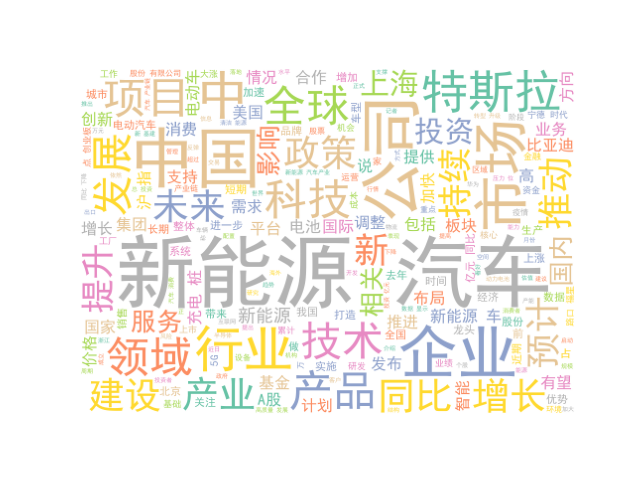

1.  **Word cloud diagrams**

 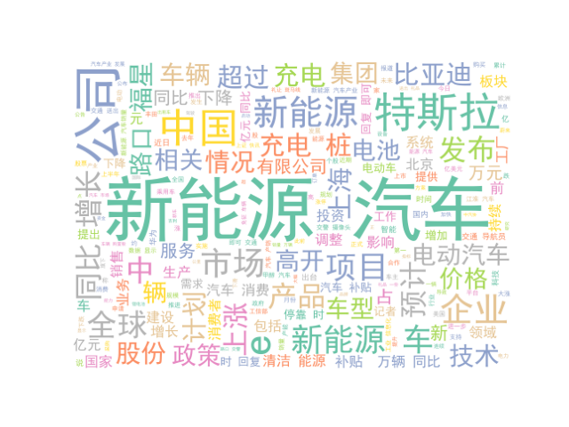

1.  **Positive Sentiment Word Cloud (left), Negative Sentiment Word
    Cloud (right)**

#  Conclusions and Recommendations

This paper analyzes the characteristics of Chinese NEV consumers by
conducting a basic and textual analysis of NEV-related microblogs, and
concludes as follows:

1.  People's attention to new energy vehicles is increasing.

2.  Men are more concerned about new energy vehicles than women.

3.  Consumers in second- and third-tier cities are paying high attention
    to new energy vehicles.

4.  People pay more attention to the news about the research and
    development of new energy vehicle technology.

5.  Neutral microblogs have the highest percentage, followed by emotions
    of anger, fear, and joy.

6.  People pay a lot of attention to car companies, especially Tesla,
    state-owned enterprises BYD and Leap, and they are more negative
    about Tesla.

7.  It is believed that the epidemic may have a certain impact on the
    new energy vehicle market.

8.  People pay more attention to charging technology and clean energy,
    and the development of charging technology may not be smooth.

9.  It is believed that the subsidy reduction policy may create
    resistance to the development of new energy vehicles.

10. People are bullish on new energy stocks and maintain a positive
    mindset.

11. People have a positive attitude towards the market development,
    industrial development and technological development of China's new
    energy vehicles.

Based on the above conclusions, this paper makes the following
suggestions for the development of China's new energy vehicle industry:

1.  The promotion of new energy vehicles should strengthen the publicity
    of female consumers.

2.  The promotion of new energy vehicles is insufficient, and more
    investment is needed.

3.  New energy vehicles are still in the stage of technological
    development, and China's new energy vehicle industry still has a lot
    of room for development in terms of technology.

4.  Charging technology, which is a key technology, and clean energy,
    which is a difficult point in the development of the automobile
    industry, are important research directions.

5.  It is necessary to further promote the development of infrastructure
    to promote the development of the new energy vehicle industry.

6.  In the context of declining subsidies, it is necessary to study how
    other policies can promote the development of the new energy vehicle
    industry.

7.  The market share of domestic automakers is insufficient, and further
    market expansion is needed.
